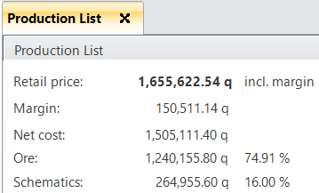
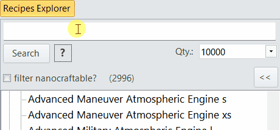
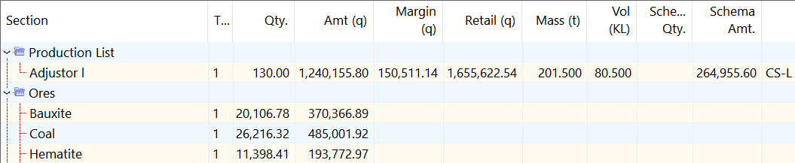

# Changelog

## v2024.1.11

### **IMPORTANT READ:**  

- **Important:**  
- *Talent values* moved to a separate, new file **talentValues.json**
(in folder %APPDATA%\Roaming\DU-Industry-Tool), thus it is no longer in
danger of being overwritten by the release archive.  
- Run this version once and values from the old talentSettings file will be
ported over. Only the schematic skills need to be set up again once.
- Then the old talentSettings.json file is obsolete and can be removed.
- The talents structure and its dialog have been rewritten.  
The new file "talentSettings v2.json" file contains structural info
on talents for them being displayed in an ingame-like structure.
- From now on always replace the talentSettings v2.json file with the
the one provided in the release archive to stay current.  
Do not manually edit it!
- Added long-time missing talents for **product refinery efficency** (for all
tiers from Basic to Exotic), **assembly-** / **industry efficiency** and their
companion **efficiency handling** talents, for sizes XS to XL.  
- Now all files for settings are stored in above roaming folder to avoid
Windows write permission errors if the application is run from the
Program Files folder etc.
- The production time calculations *should* now use all available talents,
but this will be further reviewed with the next update(s).

### Other changes

- **Theming** of the application has been completely overhauled and several more
themes were added, offering a range of colors, down to almost all-black.
A lot of time was spent of fixing some color conflicts, like dark text on
dark background or vice versa, that are manually corrected at runtime.
- Small "open" issue: the results grid's header row is still unthemed
until I replace the grid with a different component, but that is not trivial.
- With the above talents now present, the batch time calculation has been fixed,
in most ways.  
For example: *Nitron fuel*, with maxed out talents on atmo fuel production and the
chemical industry type, it will now show 105 L input (for first ingredient),
875 L output and require 7 schematics per batch.  
The time may be off by a couple of seconds due to however DU rounds values.  
In the calculation results it will still refer to batches as the volume-based
result, e.g. for 1750 L of Nitron output, it will show 2 batches (and 14 schematics
required in the main results grid).
- Using the "F+"/"F-" buttons in the results panel to change font size now
stores that size in the settings and remembers it across sessions.  
- Enabled multi-row selection in results grid, so multiple rows can be copied to clipboard.
- Fixed Discord link in Options with a non-expiring link.
- For developers: the solution has been overhauled structurally.  
There are new classes for both the settings and talents management.  
Several files were moved to separate folders.  
Also upgraded the used KryptonToolkit to the current Canary version.

## v2024.1.10

- Hotfix for atmo fuel calculation (Nitron)
- Hotfix for Excel export with margins applied showing wrong values
- Added "Fuel Efficiency" to the talentSettings.json file. It has only influence
on additional infos about batch sizes and refining times.
However, since we do not yet have any industry efficiency and handling talents,
the displayed values will still differ from values shown in game.
- Fixed Kergon-X5 not having fuel talents been applied
- **Note:** with one of next updates I will separate the talents and
and the entered user values into separate files, so that the talentSettings.json
file can be updated at any time without loosing your entered values.  
For now, keep a backup of that file before updating from the ZIP file and
restore it if necessary.  
For now the calculations should not be influenced by its changes in this patch.

## v2024.1.9

- Main form: added "Apply Gross Margin (%)" and "Round topline sums" options (of power of tens).
Like rounding up to "next 100", "next 1000" quanta etc.  

- Each calculation tab has these options independently, so there is also a button
to save the ones on the current tab as default values for any tab that is opened next.
- In a production list, the margin is applied to individual items and summed up. 
The same applies for the Excel export
- The rounding is applied to the total gross price only
- Enhanced the Excel export to take these new options into account
- Revised ordering and labeling of calculation result values, added display of the margin (q)  

- Main and production list form: recipe search boxes now support ingame-like search
with partial matches. Type at least 2 characters. When popup with entries appears,
select an entry by up/down keys or mouse.  
Then either hit ENTER or double-click the entry to run the calculation.  
Hit ESC to clear the search box.
- Search boxes support "\*" (asterisk) as wildcard, like "re mil\*eng\*" to list
all Rare Military Engines  

- Revised calculation to better deal with common rounding issues as we -
especially for production lists - want to be able to provide a per item cost
(also relevant to detailed Excel export)
- Main form: fixed ribbon button "Add to List" to actually start a new production
list if currently none is active/loaded
- Main form: calculation grid now allows CTRL+C to copy values of a line to the clipboard
- Main form: the production list selection box in the Tools ribbon bar can now
be cleared via a new button. The most recent list will be the first entry now
- Production list: now allows to add honeycombs
- Production list: grid now allows to delete a row with CTRL+DEL key combo
- Production list: fixed empty grid issue after having loaded a list from file
- Calculation grid with alternating row colors for better readability  

- Performance improvements for calculating production lists with dozens of items
- Talents form: talents are now grouped, by e.g. Crafting, Ammo, Fuel, Scraps
- Settings storage for options etc. has been rewritten. Now the settings file is
created in folder "%APPDATA%\Roaming\DU-Industry-Tool" in file "settings.json"  
That file contains e.g. above mentioned margin and rounding options as well
as the recently added schematic talent values
- Recipe name for "Surrogate Pod Station m" fixed to be "s" instead
- Revised again display of forms with Windows scaling at 100% and e.g. 125%.
If you experience "misplaced" labels or entry fields, i.e. their content
becomes cut off, please let me know.
- Lots of fixes for bugs unfortunately introduced in the last patch(es)
- Release date: 2024-01-20

## v2024.1.8

- Talents form: finally resized it to fit long names so that these aren't truncated anymore
- Ore values form: max. allowed value increased to 999K
- Schematics form: added skill import button for du-craft.online website (via clipboard)
- Schematics form: fix Export button location, wasn't anchored correctly
- Export to Excel for calculations/production lists
- Main form: cosmetic fixes for 100% vs. 125% Windows scaling

## v2024.1.7

- Schematics: UI fixes due to DPI scaling

## v2024.1.6

- Schematics dialog: it is extended to be a calculator: each schematic can have a
quantity and gets the sum displayed. The total of all is below the grid.
- Added 3 buttons to load, save the entered quantities from/to a file as well
as a button to reset all.
- Export button now has options to include/exclude data
- Usage hint: select talents and hit Apply button to recalculate all schematics.

## v2024.1.4

- IMPORTANT: "schematicsValues.json" file has been updated and should NOT be manually edited!
- Added 4 talents to the Schematics form (schematics crafting) for cost and output for accurate schematic prices
- Added Excel export button to the schematics dialog incl. time and item ID
- MarketOrders.json: added a "Description" attribute to give the actual item's name; also re-added the PlayerId if found
- Fixed some internal forms handling

## v2024.1.3

- Decided to use the "Full schematics" option also on the Schematics in the bottom calculation tree
- Quantities and amounts are now displayed rounded to 3 decimals
- With above also fixed in some cases schematics for products/ammo being rounded down instead of up

## v2024.1.2

- Fix: if quantity is below batch output, use at least 1 schematic for products/ammo, still

## v2024.1.1

- Finally fixed ammo calculations (min. batch output size of 40)
- Fixed some calculation form label placements
- Changed versioning to year.month.release so it is clearer how old a version is

## v1.4.4

- Fixed some elements' names, like Maintenance Unit and some Modern Screens
- added unit's mass and volume display
- removed pre-1.0 changelog entries from changelog

## v1.4.3

- Resized search controls for better readability

## v1.4.2

- Added "Cost for 1" to results
- Adjusted "Related Talents" display

## v1.4.1

- Fixed: all industry for recipes should now be correct (on which something is produced)
- Several more updates to production times

## v1.4.0

- Added more default values to quantity search combobox
- Updated recipes based on du-lua.dev recipes data of DU v1.4
  - Concrete product: fixed Carbon/Silicon ingredients from 38.0 to 37.5 L
  - Added Uncommon Firing System XS/S/M
  - Fixed names of several very large modern screens
  - Fixed name for "Rare Control System l" (had "Advanced")
  - Applied updates to several recipes to unit volume, mass or production time
  - Renamed Repair Unit xl to Maintenance Unit xl

## v1.1.5

- Transparent Screens: fixed element schematics
- Excluded Hydrogen, Oxygen, Catalyst from calculation/grid display

## v1.1.4

- Concrete product ingredients fix
- Fixed industry for Poly* products
- Added Kergon-X5
- Fixed recipe calculation for Refined Materials

## v1.1.3

- Fixed: calculation of production list was broken
- Fixed: empty entries in production list caused exception

## v1.1.2

- Fixed: added 2 missing parts in recipes
- File|Export to CSV: it now takes the currently entered quantity instead of just 1.
- File|Export to CSV: renamed "Cost to make" to "Ore Cost" and added columns "Schematic Cost" and "Total Cost"

## v1.1.1
a
- Options: added "Full schematic quantities" (default: checked) to calculate
full costs of schematics (on) or fractional costs (off).
Results display also shows either e.g. 7 schematics vs. 6.44 schematics.

## v1.1.0

- Updated recipes to include most changes as per DU patch 1.1

## v1.0.6

- Applied v1.0.5 corrections to recipes file (was left out due to time constraints)
- Textual changes from "" to null for unset schematic keys in recipes file

## v1.0.5

- More corrections in schematics file with regard to release data

## v1.0.4

- Fixed 771 legacy schematic prices in recipes file

## v1.0.3

- Fixed fuels schematic quantity calculation
- Fix duplicate addition of element schematic
- Fixed version number in About dialog

## v1.0.2

- Fixed industry size detail for 259 recipes
- Ore values: improved editing of price

## v1.0.1

- Fix for market order reading regex (thanks to Ferry)

## v1.0.0

- Major revamp of calculation output as a tree layout
- Double-click an ore, pure, product or part in tree to drill-down.
- Ores will display additional details, like refiner input/output values and time to refine, taking talents into account.
- Related talents for ores and pures are shown and can instantly be changed/corrected.
- Updated recipe base with current data from release thanks to du-lua.dev!
- Added "Recalculate" button on the results page (for both regular items as well as Production List).
- Added "[tier] Pure Refinery Efficiency" talents for Pures to allow for correct production batch sizes and times.
- Added display of number of entries in the recipe tree's nodes
- Added nanocraft filter checkbox above recipe tree
- Added checkbox option in ribbon bar to restore window position/size.
- Added checkbox option in ribbon bar to load last opened Production List file on startup.
- Moved setup-related items from the "File" menu (Ore prices,Talents,Schematics) to new Setup group under Tools.
- Added multiple ribbon buttons for managing a Production List (add/remove/clear).
- Added "F+"/"F-" buttons on top line of results window to (temporarily) increase/decrease font size (will be improved later).
- Added "Load Config"/"Save Config" buttons on top line of results window to save or restore grid column sizes.
- Added a combobox to pick a file from all recently opened production list files.
- Added hotkey CTRL+W to close current tab
- Added hotkeys CTRL+O to open and CTRL+S to save a currently open Production List.
- Search "quantity" box now allows entering of manual numeric values.
- Name of currently open Production List is shown in window title.
- Tabs now each have their own close button.
- Several more fixes of schematics data and their calculation.
- Internal refactoring, especially of the IndustryManager class.
- NOTE: Options/settings in the ribbon bar are all stored in file "DU-Industry-Tool.usersettings.json" (where the app is located).
- NOTE: windows restore **currently** only supports 1 screen (will be improved later).
- NOTE: not all ore/pures/products talents are yet implemented!
